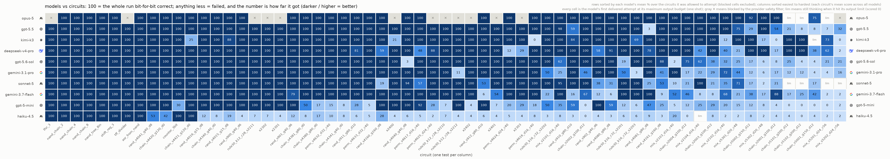

# Lockstep

Can a language model run a logic circuit in its head?

Article: https://lockstep.greg.technology



Every cell is one model's first delivered attempt at its full token budget
simulating one circuit
(NAND gates + D flip-flops, output the bit trace, scored mechanically against
an answer key verified nine independent ways). Full details: `METHODS.md`.

```
uv sync                                              # install
uv run pytest                                        # run the test suite
uv run python scripts/rescore.py                     # re-derive every published score offline
uv run python -m lockstep.harness circuits/*.json circuits/*/*.json
                                                     # re-verify all 63 answer keys, 9 ways
```

The last command needs `brew install icarus-verilog verilator` (iverilog >= 12,
verilator >= 5). The first three need nothing but Python. More:
`REPRODUCING.md`.

## Layout

- `lockstep/` — the harness (netlist, simulator, verilog emission, eval runner)
- `SEMANTICS.md` — the one-page spec every evaluator was written from
- `METHODS.md` — how every published number was produced
- `oracles/` — independently written simulators and translators, verbatim
- `circuits/` + `keys/` — all 63 circuits and their answer keys
- `results/` — every model attempt verbatim: prompt, response, reasoning, score
- `fuzz/` — 1600 fuzz circuits across two agreement campaigns
- `analysis/` — charts and the one-shot selection rule
- `tests/` — including mutation tests proving the agreement check can fail
- `site/` — the article and explorer

License: MIT (code), CC BY 4.0 (data) — see LICENSE and LICENSE-DATA.
